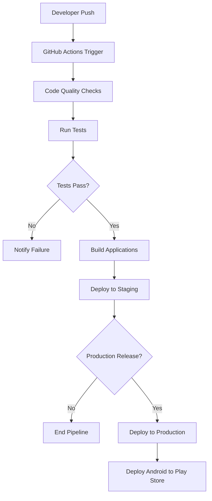
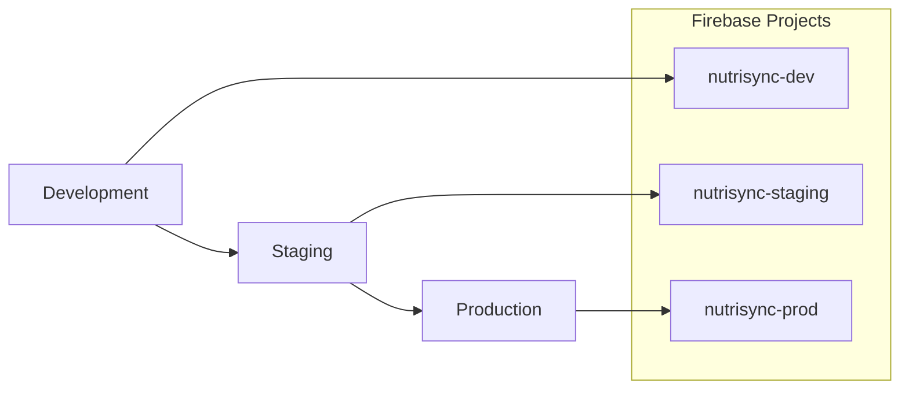

# Design Document: CI/CD and Multi-Platform Deployment

## Overview

This design outlines the implementation of a comprehensive CI/CD pipeline for NutriSync, including GitHub repository preparation, automated testing, and multi-platform deployment to web and Android platforms. The system will use GitHub Actions for automation, Firebase for web hosting, and Google Play Store for Android distribution.

## Architecture

### CI/CD Pipeline Architecture



### Environment Structure



## Components and Interfaces

### 1. GitHub Actions Workflows

#### Main CI/CD Workflow (.github/workflows/main.yml)
- **Purpose**: Primary pipeline for continuous integration and deployment
- **Triggers**: Push to main, pull requests, release tags
- **Jobs**: 
  - Code quality checks
  - Flutter tests
  - Firebase Functions tests
  - Build and deploy

#### Android Release Workflow (.github/workflows/android-release.yml)
- **Purpose**: Specialized workflow for Android app releases
- **Triggers**: Release tags matching pattern `v*`
- **Jobs**:
  - Build signed APK/AAB
  - Upload to Google Play Console
  - Create GitHub release

#### Security Scanning Workflow (.github/workflows/security.yml)
- **Purpose**: Regular security vulnerability scanning
- **Triggers**: Schedule (weekly), pull requests
- **Jobs**:
  - Dependency vulnerability scan
  - Code security analysis
  - Firebase rules validation

### 2. Configuration Management

#### Environment Configuration Structure
```
config/
├── environments/
│   ├── development.json
│   ├── staging.json
│   └── production.json
├── firebase/
│   ├── dev/
│   ├── staging/
│   └── prod/
└── secrets/
    ├── example.env
    └── README.md
```

#### Firebase Configuration
- **Multiple Projects**: Separate Firebase projects for each environment
- **Service Account Keys**: Stored as GitHub secrets
- **Environment Variables**: Injected during build process

### 3. Build and Deployment System

#### Flutter Web Build Process
1. Install Flutter SDK
2. Get dependencies
3. Run tests
4. Build web application
5. Deploy to Firebase Hosting

#### Android Build Process
1. Setup Java and Android SDK
2. Configure signing keystore
3. Build signed APK/AAB
4. Upload to Google Play Console
5. Create release notes

## Data Models

### GitHub Secrets Structure
```yaml
# Firebase Configuration
FIREBASE_SERVICE_ACCOUNT_DEV: "base64-encoded-service-account"
FIREBASE_SERVICE_ACCOUNT_STAGING: "base64-encoded-service-account"
FIREBASE_SERVICE_ACCOUNT_PROD: "base64-encoded-service-account"

# Android Signing
ANDROID_KEYSTORE: "base64-encoded-keystore"
ANDROID_KEYSTORE_PASSWORD: "keystore-password"
ANDROID_KEY_ALIAS: "key-alias"
ANDROID_KEY_PASSWORD: "key-password"

# Google Play Console
GOOGLE_PLAY_SERVICE_ACCOUNT: "base64-encoded-service-account"

# API Keys (if needed)
OPENAI_API_KEY: "api-key"
GEMINI_API_KEY: "api-key"
```

### Environment Configuration Schema
```json
{
  "firebase": {
    "projectId": "string",
    "apiKey": "string",
    "authDomain": "string",
    "storageBucket": "string",
    "messagingSenderId": "string",
    "appId": "string"
  },
  "features": {
    "enableAnalytics": "boolean",
    "enableCrashlytics": "boolean",
    "debugMode": "boolean"
  },
  "api": {
    "baseUrl": "string",
    "timeout": "number"
  }
}
```

## Correctness Properties

### Property 1: Deployment Consistency
*For any* successful deployment, all environment configurations should be properly applied and the application should be accessible at the expected URLs.
**Validates: Requirements 3.2, 4.2, 7.3**

### Property 2: Security Isolation
*For any* deployment pipeline execution, no secrets or sensitive data should be exposed in logs or build artifacts.
**Validates: Requirements 5.1, 5.5**

### Property 3: Build Reproducibility
*For any* given commit hash, building the application multiple times should produce identical artifacts.
**Validates: Requirements 2.4, 4.1**

### Property 4: Test Coverage Enforcement
*For any* code change, the CI pipeline should enforce minimum test coverage thresholds before allowing deployment.
**Validates: Requirements 8.3**

### Property 5: Environment Separation
*For any* deployment, the correct environment-specific configuration should be used without cross-contamination.
**Validates: Requirements 7.2, 7.4**

## Error Handling

### Pipeline Failure Scenarios
1. **Test Failures**: Stop pipeline, notify developers, provide detailed logs
2. **Build Failures**: Retry once, then fail with diagnostic information
3. **Deployment Failures**: Rollback to previous version, alert team
4. **Security Scan Failures**: Block deployment, create security issue

### Rollback Strategy
- **Web**: Firebase Hosting automatic rollback to previous version
- **Android**: Manual rollback through Google Play Console
- **Database**: Firestore rules rollback through version control

### Monitoring and Alerting
- **Slack/Discord Integration**: Real-time notifications for pipeline status
- **Email Notifications**: Critical failure alerts
- **Dashboard**: Pipeline status and deployment history

## Testing Strategy

### Automated Testing Levels
1. **Unit Tests**: Individual component testing
2. **Integration Tests**: Service integration testing
3. **Widget Tests**: Flutter UI component testing
4. **End-to-End Tests**: Full application flow testing

### CI/CD Pipeline Testing
1. **Pipeline Validation**: Test pipeline configuration changes
2. **Deployment Testing**: Verify deployments in staging environment
3. **Security Testing**: Automated vulnerability scanning
4. **Performance Testing**: Build time and deployment speed monitoring

### Quality Gates
- **Code Coverage**: Minimum 80% coverage required
- **Test Success Rate**: 100% test pass rate required
- **Security Scan**: No high-severity vulnerabilities
- **Lint Checks**: Zero linting errors or warnings

## Implementation Phases

### Phase 1: Repository Preparation
1. Create .gitignore and security configurations
2. Set up example configuration files
3. Create comprehensive README and documentation
4. Initialize GitHub repository structure

### Phase 2: Basic CI Pipeline
1. Implement Flutter testing workflow
2. Add code quality checks
3. Set up basic Firebase deployment
4. Configure environment management

### Phase 3: Android Deployment
1. Configure Android build pipeline
2. Set up Google Play Console integration
3. Implement signed APK/AAB generation
4. Add release automation

### Phase 4: Advanced Features
1. Add security scanning
2. Implement multi-environment support
3. Set up monitoring and alerting
4. Add performance optimization