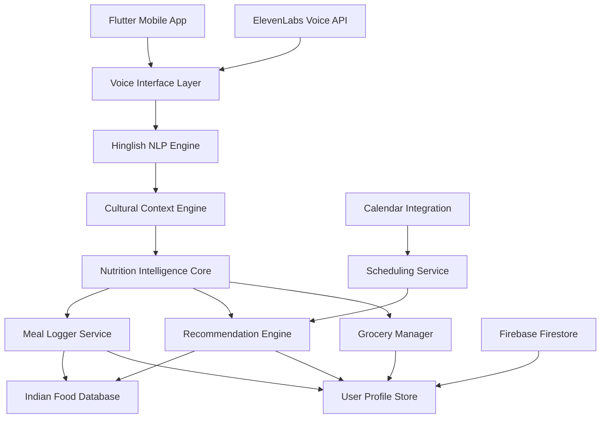

# Design Document

## Overview

Belly Buster's Voice-First AI Agent is designed as a conversational AI system that replaces expensive human nutritionists for the Indian middle class. The system combines real-time voice processing, cultural food understanding, and automated meal management to provide an affordable, accessible digital dietician experience.

The architecture prioritizes low-latency voice interactions, cultural relevance for Indian dietary patterns, and seamless integration with existing Flutter mobile infrastructure.

## Architecture

The system follows a microservices architecture with the following core components:



### Component Responsibilities

- **Voice Interface Layer**: Handles speech-to-text, text-to-speech using ElevenLabs
- **Hinglish NLP Engine**: Processes mixed Hindi-English language inputs
- **Cultural Context Engine**: Understands Indian food context, cooking methods, portions
- **Nutrition Intelligence Core**: Central orchestrator for all nutrition-related logic
- **Meal Logger Service**: Automated meal tracking and nutritional calculation
- **Recommendation Engine**: Personalized meal and nutrition suggestions
- **Indian Food Database**: Comprehensive nutritional data for Indian foods
- **Grocery Manager**: Shopping list generation and management
- **User Profile Store**: User preferences, goals, and historical data

## Components and Interfaces

### Voice Interface Layer

**Purpose**: Provides seamless voice interaction with sub-3-second response times

**Key Methods**:
```dart
class VoiceInterface {
  Future<String> processVoiceInput(AudioData audio);
  Future<AudioData> generateVoiceResponse(String text);
  Stream<VoiceInteraction> startConversation();
  void handleInterruption();
}
```

**Integration**: Uses ElevenLabs API for high-quality, low-latency voice synthesis optimized for Indian accents and Hinglish pronunciation.

### Hinglish NLP Engine

**Purpose**: Accurately parses mixed Hindi-English food descriptions and queries

**Key Methods**:
```dart
class HinglishProcessor {
  FoodItem extractFoodItems(String hinglishText);
  NutritionQuery parseQuery(String userInput);
  String generateHinglishResponse(NutritionAdvice advice);
  List<String> identifyAmbiguousTerms(String input);
}
```

**Training Data**: Custom dataset of Indian food descriptions in Hinglish, regional variations, and common colloquialisms.

### Cultural Context Engine

**Purpose**: Provides deep understanding of Indian dietary patterns and cultural food context

**Key Methods**:
```dart
class CulturalContextEngine {
  CookingMethod identifyCookingStyle(String description);
  PortionSize estimateIndianPortion(String foodItem, String portionDesc);
  List<FoodItem> expandMealContext(FoodItem primaryFood);
  RegionalVariation getRegionalContext(String location, String dish);
}
```

**Cultural Knowledge Base**:
- Regional cooking variations (North Indian, South Indian, Bengali, etc.)
- Traditional portion measurements (katori, glass, roti count)
- Common food combinations and meal patterns
- Festival and seasonal food preferences

### Nutrition Intelligence Core

**Purpose**: Central orchestrator that coordinates all nutrition-related services

**Key Methods**:
```dart
class NutritionIntelligenceCore {
  Future<MealLogResult> processMealLogging(VoiceInput input);
  Future<NutritionAdvice> generateRecommendations(UserProfile profile);
  Future<String> answerNutritionQuery(String query, UserContext context);
  Future<void> updateUserProgress(MealData meal);
}
```

### Indian Food Database

**Purpose**: Comprehensive nutritional database optimized for Indian foods

**Schema**:
```dart
class IndianFoodItem {
  String name;
  List<String> aliases; // Regional names, Hinglish variations
  NutritionalInfo nutrition;
  CookingVariations cookingMethods;
  PortionGuides portionSizes;
  RegionalAvailability regions;
}
```

**Data Sources**:
- IFCT (Indian Food Composition Tables)
- Regional nutrition surveys
- Crowdsourced data from Indian users
- Restaurant and packaged food data

## Data Models

### User Profile
```dart
class UserProfile {
  String userId;
  PersonalInfo personalInfo;
  DietaryGoals goals;
  HealthConditions conditions;
  FoodPreferences preferences;
  EatingPatterns patterns;
  SubscriptionTier tier;
}

class DietaryGoals {
  GoalType type; // weight_loss, muscle_gain, maintenance
  double targetWeight;
  int timeframe;
  ActivityLevel activityLevel;
}
```

### Meal Data
```dart
class MealData {
  String mealId;
  DateTime timestamp;
  MealType type; // breakfast, lunch, dinner, snack
  List<FoodItem> foods;
  NutritionalSummary nutrition;
  String voiceDescription;
  double confidenceScore;
}

class FoodItem {
  String name;
  double quantity;
  String unit;
  NutritionalInfo nutrition;
  CulturalContext context;
}
```

### Voice Interaction
```dart
class VoiceInteraction {
  String sessionId;
  DateTime timestamp;
  String userInput;
  String systemResponse;
  InteractionType type;
  Map<String, dynamic> context;
}
```

## Error Handling

### Voice Processing Errors
- **Network Issues**: Graceful degradation to offline voice processing
- **Unclear Speech**: Polite clarification requests in Hinglish
- **Unsupported Languages**: Gentle guidance back to Hinglish

### Food Recognition Errors
- **Unknown Foods**: Ask for description and learn from user input
- **Ambiguous Descriptions**: Interactive clarification with multiple choice options
- **Portion Estimation**: Use visual references familiar to Indian users

### System Errors
- **Database Unavailable**: Cache recent data for offline functionality
- **API Failures**: Fallback to simplified responses with retry mechanisms
- **User Data Corruption**: Automatic backup and recovery procedures

## Correctness Properties

*A property is a characteristic or behavior that should hold true across all valid executions of a system—essentially, a formal statement about what the system should do. Properties serve as the bridge between human-readable specifications and machine-verifiable correctness guarantees.*

### Property 1: Voice Recognition Accuracy
*For any* valid Hinglish food description, when processed by the Voice_Agent, the system should correctly identify all mentioned food items with their appropriate nutritional mappings
**Validates: Requirements 1.1, 1.2**

### Property 2: Meal Logging Consistency  
*For any* meal logged via voice, the Meal_Logger should automatically calculate nutritional values and provide spoken confirmation that matches the logged data
**Validates: Requirements 1.3, 1.4**

### Property 3: Ambiguity Handling
*For any* ambiguous or unclear food description, the Voice_Agent should request clarification in Hinglish rather than making incorrect assumptions
**Validates: Requirements 1.5**

### Property 4: Cultural Context Recognition
*For any* Indian cooking method or regional dish mentioned, the Cultural_Context_Engine should recognize and apply appropriate cultural understanding to nutritional calculations
**Validates: Requirements 2.1, 2.2, 2.5**

### Property 5: Indian Measurement Units
*For any* portion estimation request, the system should use familiar Indian measurement references (katori, roti count, glass) rather than Western units
**Validates: Requirements 2.4**

### Property 6: Tier-Based Access Control
*For any* premium feature access attempt by free users, the system should prompt for subscription upgrade while maintaining data integrity across tier transitions
**Validates: Requirements 3.4, 3.5**

### Property 7: Grocery List Generation
*For any* meal plan created, the Grocery_Manager should automatically generate categorized shopping lists that respect user dietary restrictions and consumption patterns
**Validates: Requirements 4.1, 4.2, 4.3, 4.5**

### Property 8: Healthy Alternatives
*For any* commonly purchased grocery item, the Grocery_Manager should suggest healthier alternatives when available
**Validates: Requirements 4.4**

### Property 9: Hinglish Response Consistency
*For any* nutrition question asked, the system should provide responses in Hinglish using simple, non-technical language appropriate for the user's goals
**Validates: Requirements 5.2, 7.1, 7.2**

### Property 10: Conversation Context Preservation
*For any* multi-turn conversation, the Voice_Agent should maintain context and reference previous exchanges, including user's meal history and preferences
**Validates: Requirements 5.3, 5.4**

### Property 11: Interruption Recovery
*For any* conversation interruption, the Voice_Agent should handle it gracefully and resume the conversation naturally
**Validates: Requirements 5.5**

### Property 12: Personalized Recommendations
*For any* food recommendation request, the system should consider the user's medical conditions, allergies, goals, and activity level in its suggestions
**Validates: Requirements 6.3, 6.4**

### Property 13: Adaptive Learning
*For any* user progress data, the system should track patterns and adjust recommendations to optimize for the user's specific goals and results
**Validates: Requirements 6.2, 6.5**

### Property 14: Nutritional Balance Analysis
*For any* unbalanced meal, the Voice_Agent should suggest complementary foods using familiar Indian references for portion control
**Validates: Requirements 7.3, 7.4**

### Property 15: Indian Cooking Education
*For any* cooking advice request, the Educational_Component should provide tips specifically relevant to Indian dishes and cooking methods
**Validates: Requirements 7.5**

### Property 16: Schedule-Aware Meal Planning
*For any* user schedule with calendar integration, the system should suggest meal timing and quick meal options appropriate for busy periods
**Validates: Requirements 8.2, 8.4**

### Property 17: Reminder System
*For any* configured meal time, the system should send appropriate reminders and track timing patterns for optimization suggestions
**Validates: Requirements 8.3, 8.5**

## Testing Strategy

The testing approach combines unit testing for individual components and property-based testing for core nutrition logic.

### Unit Testing Focus
- Voice interface integration with ElevenLabs API
- Hinglish text processing accuracy
- Cultural context recognition for specific Indian foods
- Database query performance and accuracy
- User interface responsiveness and error handling
- Calendar integration and permission handling
- User profile creation and subscription management

### Property-Based Testing Framework
We will use the `test` package with custom property generators for comprehensive testing of nutrition logic.

**Configuration**: Each property test will run a minimum of 100 iterations to ensure robust validation across diverse inputs.

**Test Tagging**: Each property test will include a comment referencing its corresponding design property:
```dart
// Feature: voice-first-ai-agent, Property 1: Voice Recognition Accuracy
```

### Dual Testing Approach
- **Unit tests**: Verify specific examples, edge cases, and integration points
- **Property tests**: Verify universal properties across all inputs  
- Both approaches are complementary and necessary for comprehensive coverage